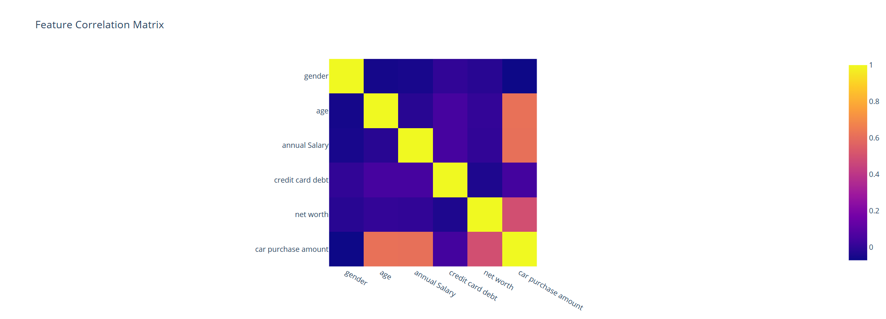
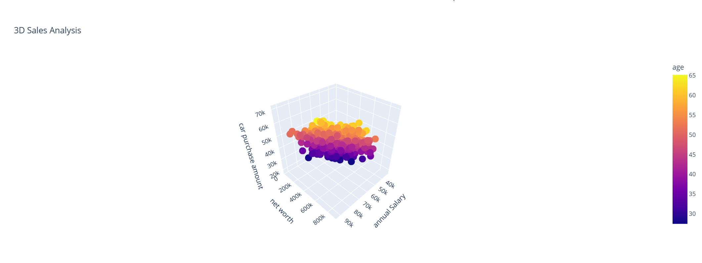
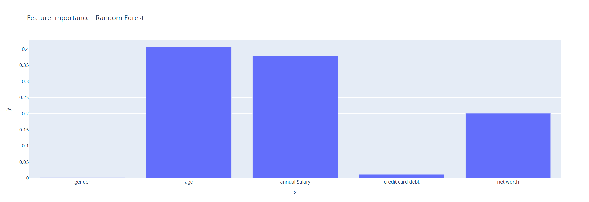

# Sales Prediction Project

This project is focused on predicting car purchasing behavior using machine learning techniques and data science. It leverages historical sales data and customer information to forecast car purchase amounts. The project applies various data preprocessing techniques, including handling missing values, removing outliers, scaling features, and training machine learning models like Random Forest and XGBoost.

## Task Objectives

- **Data Preprocessing**: Handle missing values, drop unnecessary columns, detect and remove outliers using IQR, and apply feature scaling.
- **Model Selection and Training**: Use Random Forest and XGBoost models for sales prediction.
- **Model Evaluation**: Evaluate the models using RMSE (Root Mean Squared Error) and R² Score to determine the best-performing model.
- **Hyperparameter Tuning**: Fine-tune models using GridSearchCV to optimize performance.

## Visualizations

### 1. Feature Correlation Matrix
This visualization shows the correlation between different features in the dataset, helping to identify relationships that could affect the target variable.



### 2. 3D Sales Analysis
A 3D scatter plot demonstrating the relationship between annual salary, net worth, and car purchase amount, colored by age.



### 3. Feature Importance - Random Forest
This bar chart visualizes the importance of each feature in predicting car purchase amounts using the Random Forest model.



## Installation and Setup

To run the project locally, follow these steps:

1. Clone the repository:
   ```bash
   git clone https://github.com/Shivanshhh2510/SALES-PREDICTION.git
